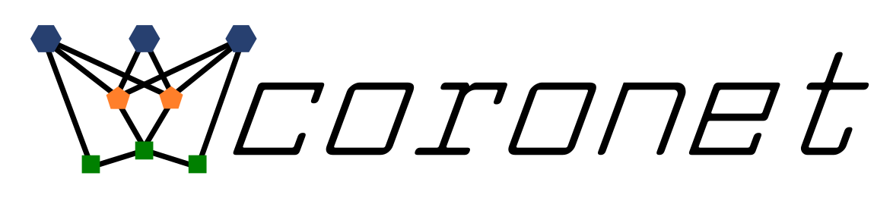
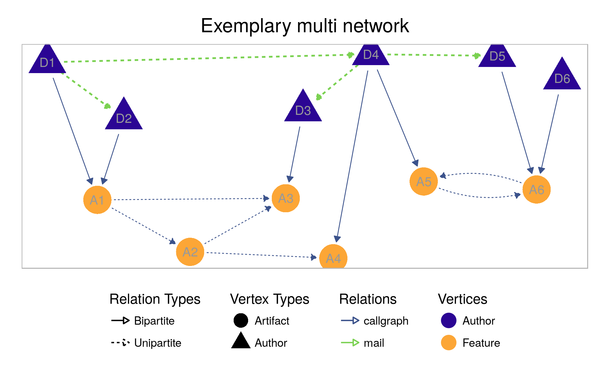

<link rel="shortcut icon" type="image/png" href="logo/3.favicon_radius.png">



# coronet––The network library

Have you ever wanted to build socio-technical developer networks the way you want? Here, you are in the right place. Using this network library, you are able to construct such networks based on various data sources (commits, e-mails, issues) in a configurable and modular way. Additionally, we provide, e.g., analysis methods for network motifs, network metrics, and developer classification.

The network library `coronet` can be used to construct analyzable networks based on data extracted from `Codeface` [[https://github.com/siemens/codeface](https://github.com/siemens/codeface)] and its companion tool `codeface-extraction` [[https://github.com/se-sic/codeface-extraction](https://github.com/se-sic/codeface-extraction)]. The library reads the written/extracted data from disk and constructs intermediate data structures for convenient data handling, either *data containers* or, more importantly, *developer networks*.

If you wonder: The name `coronet` derives as an acronym from the words "configurable", "reproducible", and, most importantly, "network". The name says it all and very much conveys our goal.



## Table of contents
  - [Integration](#integration)
    - [Requirements](#requirements)
      - [`R`](#r)
      - [`packrat` (recommended)](#packrat-recommended)
      - [Folder structure of the input data](#folder-structure-of-the-input-data)
      - [Needed R packages](#needed-r-packages)
    - [Submodule](#submodule)
    - [Selecting the correct version](#selecting-the-correct-version)
  - [Functionality](#functionality)
    - [Configuration](#configuration)
    - [Data sources](#data-sources)
    - [Network construction](#network-construction)
      - [Data sources for network construction](#data-sources-for-network-construction)
      - [Types of networks](#types-of-networks)
      - [Relations](#relations)
      - [Edge-construction algorithms for author networks](#edge-construction-algorithms-for-author-networks)
      - [Vertex and edge attributes](#vertex-and-edge-attributes)
    - [Further functionalities](#further-functionalities)
      - [Splitting data and networks based on defined time windows](#splitting-data-and-networks-based-on-defined-time-windows)
      - [Cutting data to unified date ranges](#cutting-data-to-unified-date-ranges)
      - [Handling data independently](#handling-data-independently)
    - [How-to](#how-to)
    - [File/Module overview](#filemodule-overview)
  - [Configuration classes](#configuration-classes)
    - [ProjectConf](#projectconf)
      - [Basic information](#basic-information)
      - [Artifact-related information](#artifact-related-information)
      - [Revision-related information](#revision-related-information)
      - [Data paths](#data-paths)
      - [Splitting information](#splitting-information)
      - [(Configurable) Data-retrieval-related parameters](#configurable-data-retrieval-related-parameters)
    - [NetworkConf](#networkconf)
  - [Changelog](#changelog)
  - [Contributing](#contributing)
  - [License](#license)
  - [Work in progress](#work-in-progress)


## Integration

### Requirements

While using the package, we require the following infrastructure.

#### [`R`](https://www.r-project.org/)

Minimum requirement is `R` version `4.0.5`. Hence, later `R` versions also work. (Earlier `R` versions beginning from version `3.3.1` on should also work, but some packages are not available any more for these versions, so we do not test them any more in our CI pipeline.)

We currently *recommend* `R` version `4.1.1` or `4.3.0` for reliability reasons and `packrat` compatibility, but also later `R` versions should work (and are tested using our CI script).

#### [`packrat`](http://rstudio.github.io/packrat/) (recommended)

The local package manager of `R` enables the user to store all needed `R` packages for this repository inside the repository itself.
All `R` tools and IDEs should provide a more sophisticated interface for the interaction with `packrat`([RStudio](https://www.rstudio.com/) does).

#### Folder structure of the input data

To use this network library, the input data has to match a certain folder structure and agree on certain file names.
The data folder – which can result from consecutive runs of `Codeface` [[https://github.com/se-sic/codeface](https://github.com/se-sic/codeface)] (branch `infosaar-updates`) and `codeface-extraction` [[https://github.com/se-sic/codeface-extraction](https://github.com/se-sic/codeface-extraction)] – needs to have the following structure (roughly):
  ```
  codeface-data
  ├── configurations
  │   ├── threemonth
  │   │     └──{project-name}_{tagging}.conf
  │   ├── releases
  │   │     └──{project-name}_{tagging}.conf
  │   ├── ...
  │
  └── results
      ├── threemonth
      │     └──{project-name}_{tagging}
      │           └──{tagging}
      │                ├── authors.list
      │                ├── bots.list
      │                ├── commits.list
      │                ├── commitMessages.list
      │                ├── emails.list
      │                ├── issues-github.list
      │                ├── issues-jira.list
      │                └── revisions.list
      ├── releases
      │     └──{project-name}_{tagging}
      │           └──{tagging}
      │                ├── authors.list
      │                ├── ...
      ├── ...
  ```

The names "threemonth" and "releases" correspond to selection processes that are used inside `Codeface` and describe the notation of the `revs` key in the `Codeface` configuration files.
Essentially, these are arbitrary names that are used internally for grouping.
If you are in doubt, just pick a name and you are fine (you just need to take care that you give `Codeface` the correct folders!).
E.g., if you use "threemonth" as selection process, you need to give `Codeface` and `codeface-extraction` the folder "releases/threemonth" as results folder (`resdir`  command-line parameter of `Codeface`).

`{tagging}` corresponds to the different `Codeface` commit-analysis types.
In this network library, `{tagging}` can be either `proximity` or `feature`.
While `proximity` triggers a file/function-based commit analysis in `Codeface`, `feature` triggers a feature-based analysis.
When using this network library, the user only needs to give the `artifact` parameter to the [`ProjectConf`](#projectconf) constructor, which automatically ensures that the correct tagging is selected.

The configuration files `{project-name}_{tagging}.conf` are mandatory and contain some basic configuration regarding a performed `Codeface` analysis (e.g., project name, name of the corresponding repository, name of the mailing list, etc.).
For further details on those files, please have a look at some [example files](https://github.com/siemens/codeface/tree/master/conf) in the `Codeface` repository.

All the `*.list` files listed above are output files of `codeface-extraction` and contain meta data of, e.g., commits or e-mails to the mailing list, etc., in CSV format.
This network library lazily loads and processes these files when needed.

#### Needed R packages

To manage the following packages, we recommend to use `packrat` using the `R` command `install.packages("packrat"); packrat::on()`.
This will automatically detect all needed packages and install them.
Alternatively, you can run `Rscript install.R` to install the packages.

- `yaml`: To read YAML configuration files (i.e., Codeface configuration files)
- `R6`: For proper classes
- `igraph`: For the construction of networks (package version `1.3.0` or higher is recommended)
- `plyr`: For the `dlply` splitting-function and `rbind.fill`
- `parallel`: For parallelization
- `logging`: Logging
- `sqldf`: For advanced aggregation of `data.frame` objects
- `data.table`: For faster data processing
- `reshape2`: For reshaping of data
- `testthat`: For the test suite
- `patrick`: For the test suite
- `ggplot2`: For plotting of data
- `ggraph`: For plotting of networks (needs `udunits2` system library, e.g., `libudunits2-dev` on Ubuntu!)
- `markovchain`: For core/peripheral transition probabilities
- `lubridate`: For convenient date conversion and parsing
- `viridis`: For plotting of networks with nice colors
- `jsonlite`: For parsing the issue data
- `rTensor`: For calculating EDCPTD centrality
- `Matrix`: For sparse matrix representation of large adjacency matrices (package version `1.3.0` or higher is mandatory)
- `fastmap`: For fast implementation of a map
- `purrr`: For fast implementation of a mapping function

### Submodule

Please insert the project into yours by use of [git submodules](https://git-scm.com/book/en/v2/Git-Tools-Submodules).
Furthermore, the file `install.R` installs all needed R packages (see [below](#needed-r-packages)) into your R library.
Although, the use of [packrat](https://rstudio.github.io/packrat/) with your project is recommended.

This library is written in a way to not interfere with the loading order of your project's `R` packages (i.e., `library()` calls), so that the library does not lead to masked definitions.

To initialize the library in your project, you need to source all files of the library in your project using the following command:
```R
source("path/to/util-init.R", chdir = TRUE)
```
It may lead to unpredictable behavior, when you do not do this, as we need to set some system and environment variables to ensure correct behavior of all functionality (e.g., parsing timestamps in the correct timezone and reading files from disk using the correct encoding).

**Note:** If you have used this library as a submodule already before it was renamed as `coronet`, you need to ensure that the right remote URL is used. The best way to do that is to remove the current submodule and re-add it with the new URL.

### Selecting the correct version

When selecting a version to work with, you should consider the following points:
- Each version (i.e., a tag) contains, at least, a major and a minor version in the form `v{major}.{minor}[.{bugfix}]`.
- On the branch `master`, there is always the most recent and complete version.
- You should always work with the current version on the `master` branch. If you, nonetheless, work on a former version, there might be a branch called `{your_version}-fixes` (e.g., `v2.3-fixes`) when we have fixed some extreme bugs in the current version, then select this one as it contains backported bugfixes for the former version. We will backport some very important bug fixes only in special cases and only for the last minor version of the second last major version.
- If you are confident enough, you can use the `dev` branch.


## Functionality

### Configuration

There are two different classes of configuration objects in this library:
- the `ProjectConf` class which determines all configuration parameters needed for the configured project (mainly data paths) and
- the `NetworkConf` class which is used for all configuration parameters concerning data retrieval and network construction.

You can find an overview on all the parameters in these classes [below in this file](#configuration-classes).

### Data sources

There are two distinguishable types of data sources that are both handled by the class `ProjectData` (and possibly its subclass `RangeData`):

- Main data sources (artifact networks, splittable)
    * Commit data (called `"commits"` internally)
    * E-Mail data (called `"mails"` internally)
    * Issue data (called `"issues"` internally)

- Additional (orthogonal) data sources (augmentable to main data sources, not splittable)
    * Commit messages are available through the parameter `commit.messages` in the [`ProjectConf`](#configurable-data-retrieval-related-parameters) class. Three values can be used:
        1. `none` is the default value and does not impact the configuration at all.
        2. `title` merges the commit message titles (i.e. the first non white space line of a commit message) to the commit data. This gives the data frame an additional column `title`.
        3. `messages` merges both titles and message bodies to the commit data frame. This adds two new columns `title` and `message`.
    * Gender data of authors (see also the parameter `gender` in the [`ProjectConf`](#configurable-data-retrieval-related-parameters) class)))
    * [PaStA](https://github.com/lfd/PaStA/)  data (patch-stack analysis, see also the parameter `pasta` in the [`ProjectConf`](#configurable-data-retrieval-related-parameters) class))
        * Patch-stack analysis to link patches sent to mailing lists and upstream commits
    * Synchronicity information on commits (see also the parameter `synchronicity` in the [`ProjectConf`](#configurable-data-retrieval-related-parameters) class)
        * Synchronous commits are commits that change a source-code artifact that has also been changed by another author within a reasonable time-window.
    * Custom event timestamps, which have to be specified manually (see also the parameter `custom.event.timestamps.file` in the [`ProjectConf`](#configurable-data-retrieval-related-parameters) class)


 The important difference is that the *main data sources* are used internally to construct artifact vertices in relevant types of networks. Additionally, these data sources can be used as a basis for splitting `ProjectData` in a time-based or activity-based manner – obtaining `RangeData` instances as a result (see file `split.R` and the contained functions). Thus, `RangeData` objects contain only data of a specific period of time.

 The *additional data sources* are orthogonal to the main data sources, can augment them by additional information, and, thus, are not split at any time.

All data sources are accessible from the `ProjectData` and `RangeData` objects through their respective getter methods. For some data sources, there are additional methods available to access, for example, a more aggregated version of the data.


###  Network construction

When constructing networks by using a `NetworkBuilder` object, we basically construct `igraph` objects. You can find more information on how to handle these objects on the [`igraph` project website](http://igraph.org/r/).

#### Data sources for network construction

For the construction to work, you need to pass an instance of each the classes `ProjectData` and `NetworkConf` as parameters when calling the `NetworkBuilder` constructor. The `ProjectData` object holds the data that is used as basis for the constructed networks, while the `NetworkConf` object configures the construction process in detail (see below and also Section [`NetworkConf`](#networkconf) for more information).

**Beware:** **The `ProjectData` instance** passed to the constructor of the class `NetworkBuilder` **is getting cloned** inside the `NetworkBuilder` instance! The main reason is the [latent ability to cut data to unified date ranges](#cutting-data-to-unified-date-ranges) (the parameter`unify.date.ranges` [in the class `NetworkConf`](#networkconf)) which would compromise the original given data object; consequently, data cutting is only performed on the cloned data object. Further implications are:
- When calling `NetworkBuilder$reset.environment()`, the cloned `ProjectData` object gets replaced by a new clone based on the originally given `ProjectData` instance.
- When you want to adapt the data used for network construction *after constructing a `NetworkBuilder`*, you need to adapt it via `NetworkBuilder$get.project.data()`. This also includes that, if data is read and is cached inside a `ProjectData` object *during network construction*, the cached data is only available through the `NetworkBuilder` instance!
- When you adapt the original `ProjectData` object in any way, you need to create a new `NetworkBuilder` instance!

#### Types of networks

There are four types of networks that can be built using this library: author networks, artifact networks, bipartite networks, and multi networks (which are a combination of author, artifact, and bipartite networks). In the following, we give some more details on the various types. All types and their incorporated relations can be configured using a [`NetworkConf`](#networkconf)  object supplied to an `NetworkBuilder` object. The respective relations and their meaning are explained [in the next section](#relations) in more detail.

- Author networks
     * The vertices in an author network denote authors who are uniquely identifiable by their name. There are only unipartite edges among authors in this type of network.
     * The relations (i.e., the edges' meaning and source) can be configured using the [`NetworkConf`](#networkconf) attribute `author.relation`. For the edge-construction algorithms used for constructing author networks, please also see the [respective section](#edge-construction-algorithms-for-author-networks).

- Artifact networks
     * The vertices in an artifact network denote any kind of artifact, e.g., source-code artifact (such as features or files) or communication artifact (such as mail threads or issues). All artifact-type vertices are uniquely identifiable by their name. There are only unipartite edges among artifacts in this type of network.
     * The relations (i.e., the edges' meaning and source) can be configured using the [`NetworkConf`](#networkconf) attribute `artifact.relation`. The relation also describes which kinds of artifacts are represented as vertices in the network. (For example, if "mail" is selected as `artifact.relation`, only mail-thread vertices are included in the network.)

- Commit networks
     * The vertices in a commit network denote any commits in the data. All vertices
     are uniquely identifyable by the hash of the commit. There are only unipartite edges among commits in this type of network.
     * The relations (i.e., the edges meaning and source) can be configured using the [`networkConf`](#networkconf) attribute `commit.relation`. The relation also describes the type of data used for network construction (`cochange` uses commit data, `commit.interaction` uses commit interaction data).

- Bipartite networks
     * The vertices in a bipartite network denote both authors and artifacts. There are only bipartite edges from authors to artifacts in this type of network.
     * The relations (i.e., the edges' meaning and source) can be configured using the [`NetworkConf`](#networkconf) attribute `artifact.relation`.

- Multi networks
     * The vertices in a multi network denote both authors and artifacts. There are both unipartite and bipartite edges among the vertices in this type of network. Essentially, a multi network is the combination of all other types of networks.
     * The relations (i.e., the edges' meaning and source) can be configured using the [`NetworkConf`](#networkconf) attributes `author.relation` and `artifact.relation`, respectively.

#### Relations

Relations determine which information is used to construct edges among the vertices in the different types of networks. In this network library, you can specify, if wanted, several relations for a single network using the corresponding `NetworkConf` attributes mentioned in the following.

- `cochange`
    * For author networks (configured via `author.relation` in the [`NetworkConf`](#networkconf)), authors who change the same source-code artifact are connected with an edge.
    * For artifact networks (configured via `artifact.relation` in the [`NetworkConf`](#networkconf)), source-code artifacts that are concurrently changed in the same commit are connected with an edge.
    * For commit networks (configured vie `commit.relation` in the [`NetworkConf`](#networkconf)), commits are connected if they change the same artifact.
    * For bipartite networks (configured via `artifact.relation` in the [`NetworkConf`](#networkconf)), authors get linked to all source-code artifacts they have changed in their respective commits.

- `mail`
    * For author networks (configured via `author.relation` in the [`NetworkConf`](#networkconf)), authors who contribute to the same mail thread are connected with an edge.
    * For artifact networks (configured via `artifact.relation` in the [`NetworkConf`](#networkconf)), mail threads are connected when they reference each other. (**Note:** There are no edges available right now.)
    * For bipartite networks (configured via `artifact.relation` in the [`NetworkConf`](#networkconf)), authors get linked to all mail threads they have contributed to.

- `issue`
    * For author networks (configured via `author.relation` in the [`NetworkConf`](#networkconf)), authors who contribute to the same issue are connected with an edge.
    * For artifact networks (configured via `artifact.relation` in the [`NetworkConf`](#networkconf)), issues are connected when they reference each other. (**Note:** There are no edges available right now.)
    * For bipartite networks (configured via `artifact.relation` in the [`NetworkConf`](#networkconf)), authors get linked to all issues they have contributed to.

- `callgraph`
    * This relation does not apply for author networks.
    * For artifact networks (configured via `artifact.relation` in the [`NetworkConf`](#networkconf)), source-code artifacts are connected when they reference each other (i.e., one artifact calls a function contained in the other artifact).
    * For bipartite networks (configured via `artifact.relation` in the [`NetworkConf`](#networkconf)), authors get linked to all source-code artifacts they have changed in their respective commits (same as for the relation `cochange`).

- `commit.interaction`
    * For author networks (configured via `author.relation` in the [`NetworkConf`](#networkconf)), authors who contribute to interacting commits are connected with an edge.
    * For artifact networks (configured via `artifact.relation` in the [`NetworkConf`](#networkconf)), artifacts are connected when there is an interaction between two commits that occur in the artifacts.
    * For commit networks (configured via `commit.relation` in the [`NetworkConf`](#networkconf)), commits are connected when they interact in the commit interaction data.
    * This relation does not apply for bipartite networks.

#### Edge-construction algorithms for author networks

When constructing author networks, we use events in time (i.e., commits, e-mails, issue events) to model interactions among authors on the same artifact as edges. Therefore, we group the events on artifacts, based on the configured relation (see the [previous section](#relations)).

We have four different edge-construction possibilities, based on two configuration parameters in the [`NetworkConf`](#networkconf):

- On the one hand, networks can either be *directed* or undirected (configured via `author.directed` in the [`NetworkConf`](#networkconf)). If directedness is configured, the edges are directed from the author of an event (i.e., the actor) to the authors the actor interacted with via this event.

- On the other hand, we can construct edges based on the *temporal order of events* or just construct edges neglecting the temporal order of events (configured via `author.respect.temporal.order` in the [`NetworkConf`](#networkconf)). When respecting the temporal order, for every group of events, there will be edges for each event in the group from its author to the actors of all previous events in the group. More precisely, if there are serveral previous events of an author, we construct an individual edge for each of those events (resulting in several duplicated edges arising from the same event). Potentially, this also includes loop edges (i.e., edges from one vertex to itself). Otherwise, when neglecting the temporal order, there will be mutual edges among all pairs of authors, representing all events in the group performed by one pair of authors (i.e., if directedness is configured, there are edges in both directions).

In the following, we illustrate the edge construction for all combinations of temporally (un-)ordered data and (un-)directed networks on an example with one mail thread:

Consider the following raw e-mail data for one thread (i.e., one group of events), temporally ordered from the first to the last e-mail:

| Author  | Date (Timestamp)    | Artifact (Mail Thread)     |
|---------|--------------------:| --------------------------:|
| A       | 1                   | \<thread-1\>                 |
| A       | 2                   | \<thread-1\>                 |
| B       | 3                   | \<thread-1\>                 |

Based on the above raw data, we get the following author networks with relation `mail`:

<table>
  <tr>
    <th></th>
    <th>respect temporal order</th>
    <th>without respecting temporal order</th>
  </tr>
  <tr>
    <td><strong>network directed</strong></td>
    <td><em>A ←(2)– A<br>A ←(3)– B<br>A ←(3)– B</em></td>
    <td>A –(1)→ B<br>A –(2)→ B<br>A ←(3)– B</td>
  </tr>
  <tr>
    <td><strong>network undirected</strong></td>
    <td>A –(2)– A<br>A –(3)– B<br>A –(3)– B</td>
    <td><em>A –(1)– B<br>A –(2)– B<br>A –(3)– B</em></td>
  </tr>
</table>

When constructing author networks with respecting the temporal order, there is one edge for each answer in a mail thread from the answer's author to the senders of every previous e-mail in this mail thread. Note that this can lead to duplicated edges if an author has sent several previous e-mails to the mail thread (see the duplicated edges `A –(3)– B` in the above example). This also leads to loop edges if an author of an answer has already sent an e-mail to this thread before (see the edge `A –(2)– A`).

If the temporal order is not respected, for each e-mail in a mail thread, there is an edge from the sender of the e-mail to every other author participating in this mail thread (regardless of in which order the e-mails were sent). In this case, no loop edges are contained in the network. However, it is possible that there are several edges (having different timestamps) between two authors (see the edges `A –(1)– B` and `A –(2)– B` in the example above). If directedness is configured, the edges are directed from the sender of an e-mail to the other authors.

Analogously, these edge-construction algorithms apply also for all other relations among authors (see the Section [Relations](#relations)).

#### Vertex and edge attributes

There are some mandatory attributes that are added to vertices and edges in the process of network construction. These are not optional and will be added in all cases when using instances of the class `NetworkBuilder` to obtain networks.

- Mandatory *vertex* attributes
    * `type`
        - The abstract type of data represented by the respective vertex, either an author or any type of artifact (e.g., source-code artifact or mail thread)
        - possible values: [`"Author"`, `"Artifact"`]
    * `kind`
        - The specific type of data represented by the respective vertex, augmenting the vertex attribute `type`
        - possible values: [`"Author"`,`"File"`, `"Feature"`, `"Function"`, `"MailThread"`, `"Issue"`,`"FeatureExpression"`]
    * `name`
        - The name for the data represented by the respective vertex (e.g., the author's name or a file path)

- Mandatory *edge* attributes
    * `type`
        - The abstract type of edge, either unipartite (among same-type vertices) or bipartite (among different-type vertices)
        - [`"Unipartite"`, `"Bipartite"`]
    * `relation`
        - The specific type of relation of this edge, augmenting the edge attribute `type` (see also the attributes `artifact.relation` and `author.relation` in the `NetworkConf` class)
        -  [`"mail"`, `"cochange"`, `"issue"`, `"callgraph"`]
    * `artifact.type`
        - The specific artifact type associated with the event causing the respective edge
        - [`"File"`, `"Feature"`, `"Function"`, `"Mail"`, `"IssueEvent"`,`"FeatureExpression"`]
    * `weight`
        - The weight of the respective edge
    * `date`
        - The date of the event causing the respective edge

To add further edge attributes, please see the parameter `edge.attributes` in the [`NetworkConf`](#networkconf) class. To add further vertex attributes – which can only be done *after constructing a network* –, please see the functions `add.vertex.attribute.*` in the file  `util-networks-covariates.R` for the set of corresponding functions to call.

### Further functionalities

#### Splitting data and networks based on defined time windows

Often, it is interesting to build the networks not only for the whole project history
but also to split the data into smaller ranges. One's benefit is to observe changes in the network over
time. Further details can be found in the Section [*Splitting information*](#splitting-information).

#### Cutting data to unified date ranges

Since we extract the data for each data source independently, the time ranges for available data can be quite different. For example, there may be a huge amount of time between the first extracted commit and the first extracted e-mail (and also analogously for the last commit resp. e-mail). This circumstance can affect various analyses using this network library.

To compensate for this, the class `ProjectData` supplies a method `ProjectData$get.data.cut.to.same.date()`, which returns a clone of the underlying `ProjectData` instance for which the data sources are cut to their common latest first entry date and their common earliest last entry date.

Analogously, the `NetworkConf` parameter `unify.date.ranges` enables this very functionality latently when constructing networks with a `NetworkBuilder` instance. **Note**: Please see also Section [Data sources for network construction](#data-sources-for-network-construction) for further information on data handling inside the class `NetworkBuilder`!

#### Handling data independently

In some cases, it is not necessary to build a network to get the information you need. Therefore, please remember that we offer the possibility to get the raw data or mappings between, e.g., authors and the files they edited. The data inside an instance of `ProjectData` can be accessed independently. Examples can be found in the file `showcase.R`.

### How-to

In this section, we give a short example on how to initialize all needed objects and build a bipartite network.

**Disclaimer:** The following code is configured to use sample data shipped with this repository. If you want to use the network library with a real-world project such as BusyBox, you need actual data and adjust the variables in the first block of the code to the existing data.

```R
CF.DATA = "./sample/" # path to codeface data
CF.SELECTION.PROCESS = "testing" # selection process
CASESTUDY = "sample" # project name
ARTIFACT = "feature" # the source-code artifact to use

## configuration of network relations
AUTHOR.RELATION = "mail"
ARTIFACT.RELATION = "cochange"

## initialize network library
source("./util-init.R", chdir = TRUE)

## create the configuration objects
proj.conf = ProjectConf$new(CF.DATA, CF.SELECTION.PROCESS, CASESTUDY, ARTIFACT)
net.conf = NetworkConf$new()

## update the values of the NetworkConf object to the specific needs
net.conf$update.values(list(author.relation = AUTHOR.RELATION,
                            artifact.relation = ARTIFACT.RELATION,
                            simplify = TRUE))

## get project-folder information from project configuration
cf.project.folder = proj.conf$get.entry("project") # obtaining: "sample_feature"

## create data object which actually holds and handles data
data = ProjectData$new(proj.conf)

## create network builder to construct networks from the given data object
netbuilder = NetworkBuilder$new(data, net.conf)

## create and get the bipartite network
## (construction configured by net.conf's "artifact.relation")
bpn = netbuilder$get.bipartite.network()

## plot the retrieved network
plot.network(bpn)
```

Please also see [the other types of networks we can construct](#types-of-networks).
For more information on how to use the configuration classes and how to construct networks with them, please see  [the corresponding section](#configuration-classes).
Additionally, for more examples, the file `showcase.R` is worth a look.

### File/Module overview

- `util-init.R`
    * Initialization file that can be used by other analysis projects (see Section [*Submodule*](#submodule))
- `util-conf.R`
    * The configuration classes of the project
- `util-read.R`
    * Functionality to read data file from disk
- `util-data.R`
    * All representations of the data classes
- `util-networks.R`
    * The `NetworkBuilder` class and all corresponding helper functions to construct networks
- `util-split.R`
    * Splitting functionality for data objects and networks (time-based and activity-based, using arbitrary ranges)
- `util-bulk.R`
    * Collection functionality for the different network types (using Codeface ranges, deprecated)
- `util-networks-covariates.R`
    * Functionality to add vertex attributes to existing networks
- `util-networks-metrics.R`
    * A set of network-metric functions
- `util-data-misc.R`
    * Helper functions for data handling and the calculation of associated metrics
- `util-networks-misc.R`
    * Helper functions for network creation (e.g., create adjacency matrices)
- `util-tensor.R`
    * Functionality to build fourth-order tensors
- `util-core-peripheral.R`
    * Author classification (core and peripheral) and related functions
- `util-motifs.R`
    * Functionality for the identification of network motifs (subgraph patterns)
- `util-plot.R`
    * Everything needed for plotting networks
- `util-plot-evaluation.R`
    * Plotting functions for data evaluation
- `util-misc.R`
    * Helper functions and also legacy functions, both needed in the other files
- `showcase.R`
    * Showcase file (see also Section [*How-To*](#how-to))
- `tests.R`
    * Test suite (running all tests in `tests/` subfolder)


## Configuration classes

### ProjectConf

In this section, we give an overview on the parameters of the `ProjectConf` class and their meaning.

All parameters can be retrieved with the method `ProjectConf$get.entry(...)`, by passing one parameter name as method parameter.
There is no way to update the entries, except for the revision-based parameters.

#### Basic information

- `project`
    * The project name from the Codeface analysis
    * E.g., `busybox_feature`
- `repo`
    * The repository subfolder name used by Codeface
    * E.g., `busybox`
    * **Note**: This is the casestudy name given as parameter to constructor!
- `description`
    * The description of the project from the Codeface configuration file
- `mailinglists`
    * A list of the mailing lists of the project containing their name, type and source
    * **Note:** In this configuration parameter, a list of mailing-list information (names etc.) is stored. The enumerating IDs of this list are part of the thread IDs of the data source `mails` (e.g., an entry `13#5` in the column `thread` corresponds to thread ID `5` on mailing list `13`).

#### Artifact-related information

- `artifact`
    * The artifact of the project used for all data retrievals
    * **Note**: Given as parameter to the class constructor
- `artifact.short`
    * The abbreviation of the artifact name used in file names for call-graph data
- `artifact.codeface`
    * The artifact name as in the Codeface database
    * Used to identify the right commits during data retrieval
- `tagging`
    * The Codeface tagging parameter for the project, based on the `artifact` parameter
    * Either `"proximity"` or `"feature"`

#### Revision-related information

**Note**: This data is updated after performing a data-based splitting (i.e., by calling the functions `split.data.*(...)`).
**Note**: These parameters can be updated using the method `ProjectConf$set.splitting.info()`, but you should *not* do that manually!

- `revisions`
    * The analyzed revisions of the project, initially retrieved from the Codeface database
    * A revision represents a single point in time (such as a version number or a commit hash).
- `revisions.dates`
    * The dates for the `revisions`
- `revisions.callgraph`
    * The revisions as used in call-graph file name
- `ranges`
    * The ranges constructed from the list of `revisions`
    * A range represents the time between two revisions.
    * The ranges are constructed in sliding-window manner when a data object is split using the sliding-window approach
- `ranges.callgraph`
    * The ranges based on the list `revisions.callgraph`

#### Data paths

- `datapath`
    * The data path to the Codeface results folder of this project
- `datapath.callgraph`
    * The data path to the call-graph data
- `datapath.synchronicity`
    * The data path to the synchronicity data
- `datapath.pasta`
    * The data path to the pasta data

#### Splitting information

**Note**: This data is added to the `ProjectConf` object only after performing a data-based splitting (by calling the  functions `split.data.*(...)`).
**Note**: These parameters can be updated using the method `ProjectConf$set.splitting.info()`, but you should *not* do that manually!

- `split.type`
    * Either `"time-based"` or `"activity-based"`, depending on splitting function
- `split.length`
    * The string given to time-based splitting (e.g., "3 months") or the activity amount given to acitivity-based splitting
- `split.basis`
    * The data used as basis for splitting (either `"commits"` or `"mails"`)
- `split.sliding.window`
    * Logical indicator whether a sliding-window approach has been used to split the data or network (either `"TRUE"` or `"FALSE"`)
- `split.revisions`
    * The revisions used for splitting (list of character strings)
- `split.revisions.dates`
    * The respective date objects for `split.revisions`
- `split.ranges`
    * The ranges constructed from `split.revisions` (either in sliding-window manner or not, depending on `split.sliding.window`)

#### (Configurable) Data-retrieval-related parameters

**Note**: These parameters can be configured using the method `ProjectConf$update.values()`.

- `commits.filter.base.artifact`
    * Remove all information concerning the base artifact from the commit data. This effect becomes clear when retrieving commits using `get.commits.filtered`, because then the result of which does not contain any commit information about changes to the base artifact. Networks built on top of this `ProjectData` do also not contain any base artifact information anymore.
    * [*`TRUE`*, `FALSE`]
- `commits.filter.untracked.files`
    * Remove all information concerning untracked files from the commit data. This effect becomes clear when retrieving commits using `get.commits.filtered`, because then the result of which does not contain any commits that solely changed untracked files. Networks built on top of this `ProjectData` do also not contain any information about untracked files.
    * [*`TRUE`*, `FALSE`]
- `commits.locked`
    * Lock commits to prevent them from being read if not yet present when calling the getter.
    * [`TRUE`, *`FALSE`*]
- `commmit.messages`
    * Read and add commit messages to commits. The column `title` will contain the first line of the message and, if selected, the column `message` will contain the rest.
    * [*`none`*, `title`, `messages`]
- `filter.bots`
    * Remove all commits, issues, and mails made by bots. Bots are identified using the `bots.list` file.
    * [`TRUE`, *`FALSE`*]
- `gender`
    * Read and add gender data to authors (column `gender`)
    * [`TRUE`, *`FALSE`*]
- `issues.only.comments`
    * Only use comments from the issue data on disk and no further events such as references and label changes
    * [*`TRUE`*, `FALSE`]
- `issues.from.source`
    * Choose from which sources the issue data on disk is read in. Multiple sources can be chosen.
    * [*`github`*, `jira`]
- `issues.locked`
    * Lock issues to prevent them from being read if not yet present when calling the getter.
    * [`TRUE`, *`FALSE`*]
- `mails.filter.patchstack.mails`
    * Filter patchstack mails from the mail data. In a thread, a patchstack spans the first sequence of mails where each mail has been authored by the thread creator and has been sent within a short time window after the preceding mail. The mails spanned by a patchstack are called
'patchstack mails' and for each patchstack, every patchstack mail but the first one are filtered when `mails.filter.patchstack.mails = TRUE`.
    * [`TRUE`, *`FALSE`*]
- `mails.locked`
    * Lock mails to prevent them from being read if not yet present when calling the getter.
    * [`TRUE`, *`FALSE`*]
- `pasta`
    * Read and integrate [PaStA](https://github.com/lfd/PaStA/) data with commit and mail data (columns `pasta` and `revision.set.id`)
    * [`TRUE`, *`FALSE`*]
    * **Note**: To include PaStA-based edge attributes, you need to give the `"pasta"` edge attribute for `edge.attributes`.
- `synchronicity`
    * Read and add synchronicity data to commits (column `synchronicity`)
    * [`TRUE`, *`FALSE`*]
    * **Note**: To include synchronicity-data-based edge attributes, you need to give the `"synchronicity"` edge attribute for `edge.attributes`.
- `synchronicity.time.window`:
    * The time-window (in days) to use for synchronicity data if enabled by `synchronicity = TRUE`
    * [1, *5*, 10, 15]
    * **Note**: If, at least, one artifact in a commit has been edited by more than one developer within the configured time window, then the whole commit is considered to be synchronous.
- `custom.event.timestamps.file`:
    * The file to read custom timestamps from.
    * **Note** It might make sense to keep several lists of timestamps for different purposes. Therefore, this is the only data source where the file name can be configured.
    * **Note** This parameter does not have a default value.
- `custom.event.timestamps.locked`:
    * Lock custom event timestamps to prevent them from being read if empty or not yet present when calling the getter.
    * [`TRUE`, *`FALSE`*]
- `commit.interactions`:
    * Allow construction of author and artifact networks using commit-interaction data
    * [`TRUE`, *`FALSE`*]
- `commit.interactions.filter.global`:
    * Filter out entries from commit interaction data that are not matched to a specific function or file
    * [*`TRUE`*, `FALSE`]

### NetworkConf

In this section, we give an overview on the parameters of the `NetworkConf` class and their meaning.

All parameters can be retrieved with the method `NetworkConf$get.variable(...)`, by passing one parameter name as method parameter.
Updates to the parameters can be done by calling `NetworkConf$update.variables(...)` and passing a list of parameter names and their respective values.

**Note**: Default values are shown in *italics*.

- `author.relation`
    * The relation(s) among authors, encoded as edges in an author network
    * **Note**: The  author--artifact relation in bipartite and multi networks is configured by `artifact.relation`!
    * possible values: [*`"mail"`*, `"cochange"`, `"issue"`]
- `author.directed`
    * The directedness of edges in an author network
    * [`TRUE`, *`FALSE`*]
- `author.respect.temporal.order`
    * Denotes whether the temporal order of activities shall be respected when constructing author networks (see also Section [Edge-construction algorithms for author networks](#edge-construction-algorithms-for-author-networks))
    * **Note**: If no value is specified explicitly by the user (i.e., `NA` is used), the value of `author.directed` is used for determining whether to respect the temporal order during edge construction.
    * **Note**: This parameter has *no* effect on the construction of artifact networks and bipartite networks.
    * [`TRUE`, `FALSE`, *`NA`*]
- `author.all.authors`
    * Denotes whether all available authors (from all analyses and data sources) shall be added to the network as a basis
    * **Note**: Depending on the chosen author relation, there may be isolates then
    * [`TRUE`, *`FALSE`*]
- `author.only.committers`
    * Remove all authors from an author network (including bipartite and multi networks) who are not present in an author network constructed with `artifact.relation` as relation, i.e., all authors that have no biparite relations in a bipartite/multi network are removed.
    * [`TRUE`, *`FALSE`*]
- `artifact.relation`
    * The relation(s) among artifacts, encoded as edges in an artifact network
    * **Note**: Additionally, this relation configures also the author--artifact relation in bipartite and multi networks!
    * possible values: [*`"cochange"`*, `"callgraph"`, `"mail"`, `"issue"`]
- `artifact.directed`
    * The directedness of edges in an artifact network
    * **Note**: This parameter does only affect the `issue` relation, as the `cochange` relation is always undirected, while the `callgraph` relation is always directed. For the `mail`, we currently do not have data available to exhibit edge information.
  * [`TRUE`, *`FALSE`*]
- `edge.attributes`
    * The list of edge-attribute names and information
    * a subset of the following as a single vector:
         - timestamp information: *`"date"`*, `"date.offset"`
         - general information: *`"artifact.type"`*
         - author information: `"author.name"`, `"author.email"`
         - committer information: `"committer.date"`, `"committer.name"`, `"committer.email"`
         - e-mail information: *`"message.id"`*, *`"thread"`*, `"subject"`
         - commit information: *`"hash"`*, *`"file"`*, *`"artifact"`*, `"changed.files"`, `"added.lines"`, `"deleted.lines"`, `"diff.size"`, `"artifact.diff.size"`, `"synchronicity"`
       - PaStA information: `"pasta"`,
       - issue information: *`"issue.id"`*, *`"event.name"`*, `"issue.state"`, `"creation.date"`, `"closing.date"`, `"is.pull.request"`
    * **Note**: `"date"` and `"artifact.type"` are always included as this information is needed for several parts of the library, e.g., time-based splitting.
    * **Note**: For each type of network that can be built, only the applicable part of the given vector of names is respected.
    * **Note**: For the edge attributes `"pasta"` and `"synchronicity"`, the project configuration's parameters `pasta` and `synchronicity` need to be set to `TRUE`, respectively (see below).
- `edges.for.base.artifacts`
    * Controls whether edges should be drawn between authors for being involved in authoring commits to the base artifact. This parameter does not have any effect if the base artifact was filtered beforehand (e.g., when `commits.filter.base.artifact == TRUE`, or, when `commits.filter.untracked.files == TRUE` and `artifact == FILE`; all of these options can be configured in the `ProjectConf`; warning: `commits.filter.base.artifact` and `commits.filter.untracked.files` are `TRUE` by default).
    * [*`TRUE`*, `FALSE`]
- `simplify`
    * Perform edge contraction to retrieve a simplified network
    * [`TRUE`, *`FALSE`*]
- `simplify.multiple.relations`
    * Whether the simplified network should contract edges of multiple relations into a single edge or not (if not, there will be one edge for each relation, resulting in possibly more than one edge between a pair of vertices)
    * **Note** This parameter does not take effect if ``simplify = FALSE``!
    * [`TRUE`, *`FALSE`*]
- `skip.threshold`
    * The upper bound for total amount of edges to build for a subset of the data, i.e., not building any edges for the subset exceeding the limit
    * any positive integer
    * **Example**: The amount of `mail`-based directed edges in an author network for one mail thread with 100 authors is 5049.
    A value of 5000 for `skip.threshold` (as it is smaller than 5049) would lead to the omission of this mail thread from the network.
- `unify.date.ranges`
    * Cut the data sources to the latest start date and the earliest end date across all data sources
    * **Note**: This parameter does not affect the original data object, but rather creates a clone inside a `NetworkBuilder` instance. See also Section [Cutting data to unified date ranges](#cutting-data-to-unified-date-ranges) for more information on this.
    * [`TRUE`, *`FALSE`*]

The class `NetworkBuilder` holds an instance of the `NetworkConf` class, just pass the object as parameter to the constructor.
You can also update the `NetworkConf` object at any time by calling `NetworkBuilder$update.network.conf(...)`, but as soon as you do so, all cached data of the `NetworkBuilder` object are reset and have to be rebuilt.

For more examples, please have a look into the file `showcase.R`.

## Changelog

For the most recent changes and releases, please have a look at our [NEWS](NEWS.md).

## Contributing

If you want to contribute to this project, please have a look at the file [CONTRIBUTING.md](CONTRIBUTING.md) for guidelines and further details.


## License

This project is licensed under [GNU General Public License v2.0](https://github.com/se-sic/coronet/blob/master/LICENSE).


## Work in progress

To see what will be the next things to be implemented, please have a look at the [list of issues](https://github.com/se-sic/coronet/issues).
